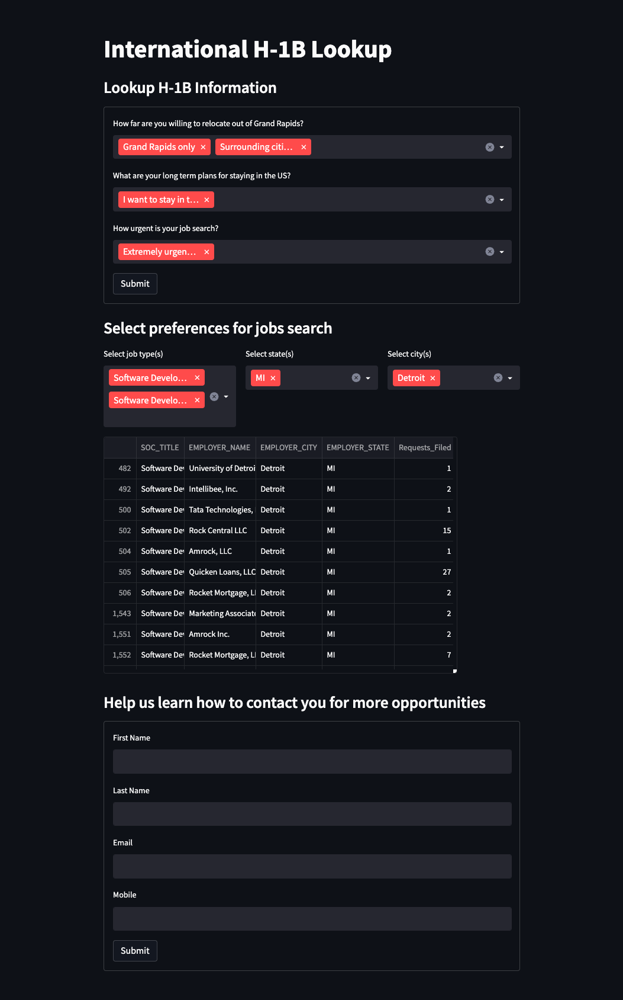

# Quick Prototyping App Streamlit
I built a very lightweight streamlit app to query H-1B job information from a database just to build familiarity with the streamlit tooling.

## Features
 - Quick form submission with multi-selection 
 - Connected it to a database hosted on Google Cloud Platform (GCP).
 - Loaded a table from BigQuery into streamlit with basic filtering
 - Contact form submission

